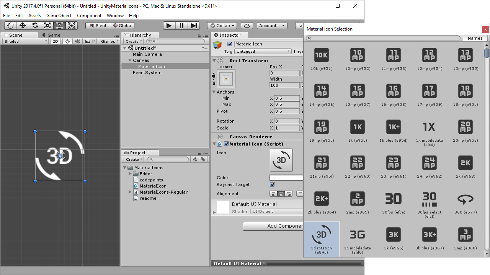

# Material Design Font Icons for Unity

## About

This projects adds capability to use Google's Material Design icon fonts in unity 3D, using text and avoiding the need for importing sprites.

The original was developed on Unity 2017, this fork was developed in Unity 2020 LTS, but should keep compatibility with previous Unity versions (not tested).

## Installation

### Package Manager

1. Open Unity's Package Manager, click the `+` button and select `Add package from git URL`
2. Copy `https://github.com/PixelsHub/md-font-icons-unity.git?path=/com.pixelshub.mdfonticons` in the text box and confirm, the package should install.

### Manually

Just copy the `com.pixelshub.mdfonticons` folder into your Unity Project assets or packages folder.

## Usage

Just add a `Material Icon UGUI` on a canvas for the UGUI version (using Unity's `Text` component) or a `Material Icon TMP` for the TextMeshPro version.

### Latest icons update

Download fonts from https://github.com/google/material-design-icons/tree/master/font and overwrite existing assets in package's Fonts folder.
Use Unity to regenerate the Font Atlas of each desired Font Asset pasting the hex character sequence found in each corresponding codepoints .txt file.
Actions for fast copy-paste:
  - Select all (Ctrl+A)
  - Set all lines with carets at end of line (Alt+Shift+I)
  - Move to first line and delete non-hex characters
  - Move to end of line, add a comma ',' and delete the space
  - Remove added comma at end of file
  - Copy all

## Credits

This project is a fork/improvement from [Convalise/unity-material-icons](https://github.com/convalise/unity-material-icons).

### Changes from original
- Prepared to work as a Unity Package
- Added support for TextMeshPro
- Added support for multiple font types (rounded, outlined...)

It makes usage of the [Material Design icons project by Google](https://github.com/google/material-design-icons).\
More information on the Google's project can be found at the [Material Icons Guide](http://google.github.io/material-design-icons/).

## License

This software is licensed under **Apache License 2.0**. You can find the full text of the license [here](LICENSE).
